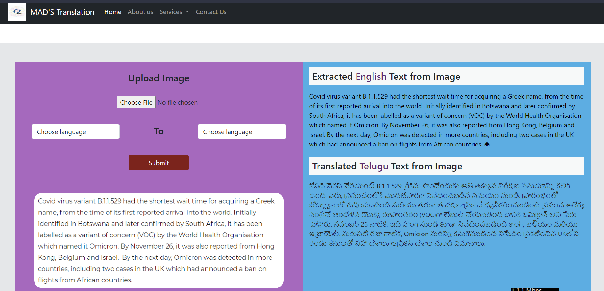
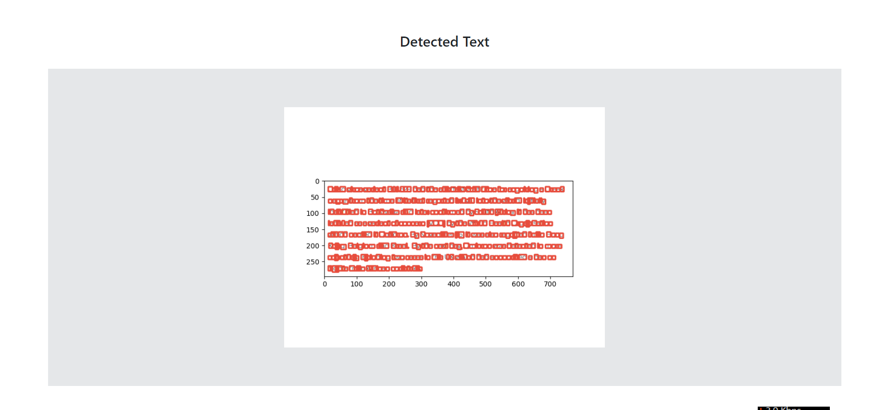
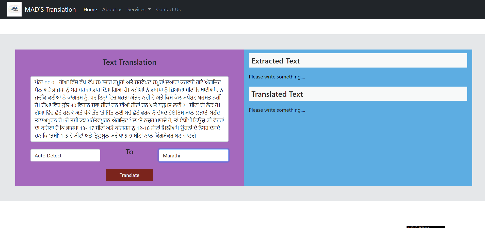
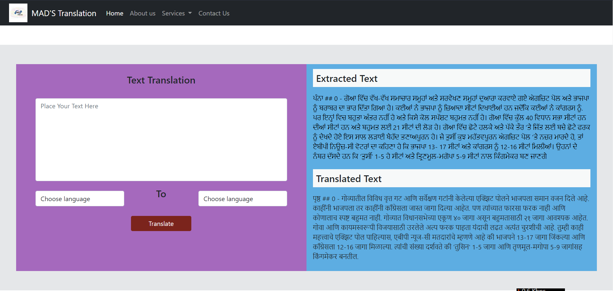
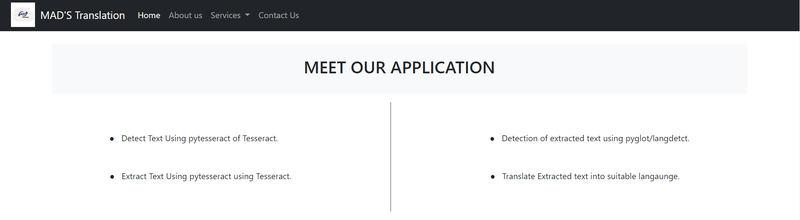
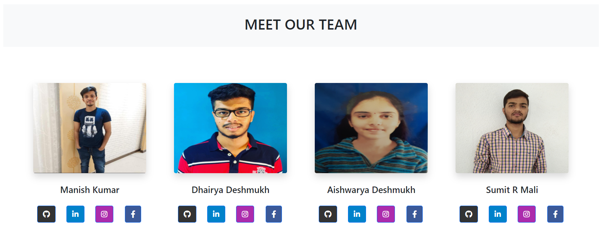

## MAD'S TRANSLATION

-------------------------------------------------------------------------------------------------------------------------------

Welcome, This is our BE final year group project. Where we have created project name "MADS Translation". 
Which takes image as input and our ML module extract text and translate it to suitable language. It works over 20 language.

_______________________________________________________________________________________________________________________________

### OUR TEAM 

#### MANISH KUMAR

    - DETECTION OF TEXT FROM IMAGE USING OPENCV-PYTHON.

#### SUMIT MALI

    - EXTRACT TEXT FROM IMAGE USING TESSERACT-OCR4.

#### AISHWARYA DESHMUKH

    - DETECT LANGUAGE FROM EXTRACTED TEXT USING LANGDETECT.

#### DHAIRYA DESHMUKH

    - TRANSLATE EXTRACTED TEXT TO SUITABLE LANGUAGE.

_______________________________________________________________________________________________________________________________

## WEBSITE

GET LIVE EXPERIENCE [MAD'S TRANSLATION](http://translatesmads.herokuapp.com/) WEBSITE.

_______________________________________________________________________________________________________________________________

### SOME GLIMSE

1) INPUT IMAGE EXTRACTION AND TRANSLATION [ ENGLISH ---> TELUGU ]

     
    
2) DETECTED TEXT SHOWN BY RED REACTANGLE [ ENGLISH ---> TELUGU ]

     
 
3) TEXT TRANSLATION  [ AUTO DETECT ---> MARATHI ]

     

4) OUTPUT OF TEXT TRANSLATION  [ AUTO DETECT ---> MARATHI ]

     
    
5) MAIN FOUR WORKING STAGES OF OUR WEBSITE 

     
    
6) OUR HARDWORKING AND CREATIVE TEAM

     

_______________________________________________________________________________________________________________________________

## LICENSE

[MIT LICENSE](https://github.com/malisumit86/madstranslations/blob/master/LICENSE)
# madstranslations
